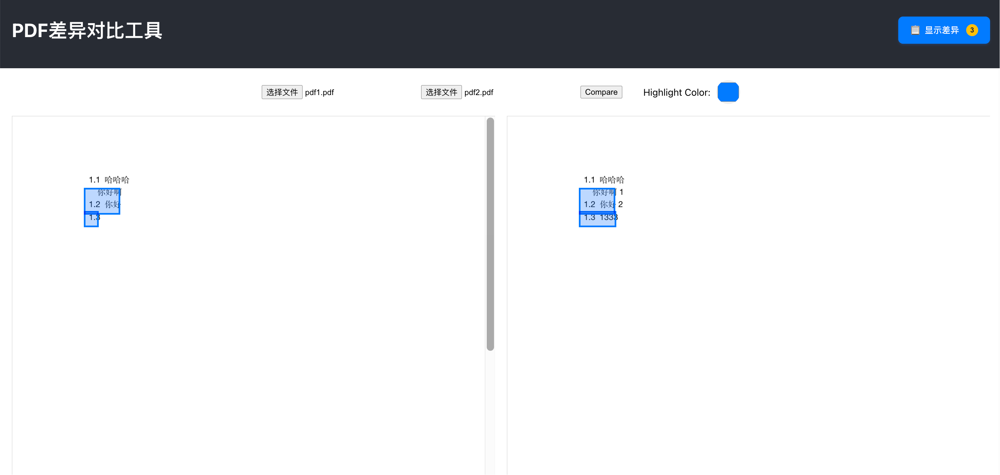
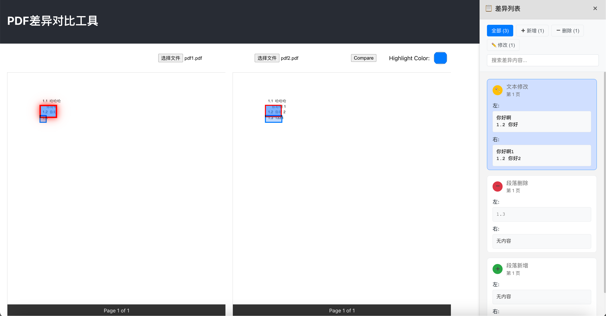

<div align="center">
  <a href="?lng=zh-CN">简体中文</a> | <a href="?lng=en-US">English</a>
</div>

<details open>
<summary><strong>English</strong></summary>

# PDF Diff Tool

A web-based utility to visually compare two PDF files and highlight their differences.

## ✨ Features Preview

<table>
  <tr>
    <td align="center"><strong>Side-by-Side Comparison</strong></td>
    <td align="center"><strong>Difference List</strong></td>
  </tr>
  <tr>
    <td></td>
    <td></td>
  </tr>
</table>

## 🛠️ Tech Stack & Prerequisites

- **Backend**: Python 3.8+, FastAPI, PyMuPDF
- **Frontend**: Node.js v18.x, React, TypeScript, pdf.js

## 🚀 Quick Start

Follow these steps to run the project locally.

### 1. Clone Repository

```bash
git clone https://github.com/Wilsonoonn/pdf-diff.git
cd pdf-diff
```

### 2. Backend Setup

Navigate to the backend directory, create a virtual environment, and install dependencies.

```bash
cd pdf-diff-backend

# Create and activate a virtual environment (recommended)
# On macOS/Linux:
python3 -m venv venv
source venv/bin/activate
# On Windows:
# python -m venv venv
# .\venv\Scripts\activate

pip install -r requirements.txt
```

Start the backend server.

```bash
# The server will run on http://127.0.0.1:8000
uvicorn main:app --reload
```

### 3. Frontend Setup

In a **new terminal**, navigate to the frontend directory and install dependencies.

```bash
cd pdf-diff-frontend
npm install
```

Start the frontend development server.

```bash
# The application will be available at http://localhost:3000
npm start
```

### 4. Usage

Open your browser and go to `http://localhost:3000`. Upload two PDF files to see the comparison.

</details>

<details>
<summary><strong>简体中文</strong></summary>

# PDF 文件对比工具

一个在线的PDF文件对比工具，可以可视化地比较两个PDF文件的差异并高亮显示。

## ✨ 功能预览

<table>
  <tr>
    <td align="center"><strong>并排对比视图</strong></td>
    <td align="center"><strong>差异列表</strong></td>
  </tr>
  <tr>
    <td></td>
    <td></td>
  </tr>
</table>

## 🛠️ 技术栈 & 环境要求

- **后端**: Python 3.8+, FastAPI, PyMuPDF
- **前端**: Node.js v18.x, React, TypeScript, pdf.js

## 🚀 快速开始

按照以下步骤在本地运行此项目。

### 1. 克隆仓库

```bash
git clone https://github.com/Wilsonoonn/pdf-diff.git
cd pdf-diff
```

### 2. 启动后端服务

进入后端目录，创建并激活虚拟环境，然后安装依赖。

```bash
cd pdf-diff-backend

# 创建并激活虚拟环境 (推荐)
# macOS/Linux:
python3 -m venv venv
source venv/bin/activate
# Windows:
# python -m venv venv
# .\venv\Scripts\activate

pip install -r requirements.txt
```

启动后端开发服务器。

```bash
# 服务器将运行在 http://127.0.0.1:8000
uvicorn main:app --reload
```

### 3. 启动前端应用

在 **新的终端窗口** 中，进入前端目录并安装依赖。

```bash
cd pdf-diff-frontend
npm install
```

启动前端开发服务器。

```bash
# 应用将运行在 http://localhost:3000
npm start
```

### 4. 开始使用

打开浏览器并访问 `http://localhost:3000`。上传两个PDF文件即可查看对比结果。

</details>
